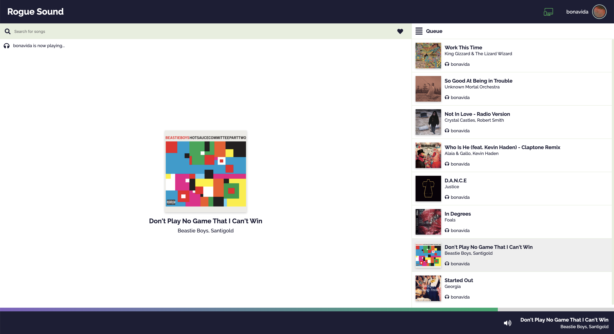

# Rogue Sound


Rogue Sound is a social music sharing website where you can play music with friends and listen to it in real time thanks to the Spotify API.



## Features

- Connect with your Spotify account. No login or registration needed (Spotify Premium required).
- Listen to music synchronized together with everyone else in the room.
- Search songs directly in the Spotify library to be added to the room queue.
- Choose the playback device directly from the browser. All Spotify available devices supported.

## Core Team
 
<table>
  <tr>
    <td align="center"><a href="https://github.com/jmolla31"><br /><sub><b>jmolla31</b></sub></a></td>
    <td align="center"><a href="https://github.com/pabravil"><br /><sub><b>pabravil</b></sub></a></td>
    <td align="center"><a href="https://github.com/bonavida"><br /><sub><b>bonavida</b></sub></a></td>
    <td align="center"><a href="https://github.com/cesarandex"><br /><sub><b>cesarandex</b></sub></a></td>
    <td align="center"><a href="https://github.com/MateoBeMo"><br /><sub><b>MateoBeMo</b></sub></a></td>
    <td align="center"><a href="https://github.com/joanstellar"><br /><sub><b>joanstellar</b></sub></a></td>
  </tr>
</table>

## Contributing

We're so glad you're thinking about contributing to Rogue Sound! If you're unsure about anything, just ask —or submit the issue or pull request anyway—. We love all friendly contributions.

If you want to contribute to this project, we encourage you to read the [frontend development guidelines](https://github.com/rogue-sound/development-guidelines/blob/master/FRONTEND_DEVELOPMENT_GUIDELINES.md).

If you have any questions, just [shoot us an email](mailto:rogue.sound.team@gmail.com) :email:.

---

## Local development

### Requirements

- node 12.xx.x
- npm 6.x.x

### Installation

First of all, clone the repository:

```bash
git clone https://github.com/rogue-sound/rogue-sound-web.git
```

And install all the dependencies:

```bash
cd rogue-sound-web
npm install
```

### Running the app on localhost

In order to make the application work, you need a `.env` file in the root directory with the following format:

```
CLIENT_ID=XXXXXXXXXXXXXXXXXXXXXXXXXX
REDIRECT_URI=http://localhost:8080
```

where `CLIENT_ID` is the id of your registered application in the [Spotify for Developers web](https://developer.spotify.com/dashboard) and `REDIRECT_URI` is the url that Spotify will use to redirect after the authentication.

To run the app in dev mode with hot-reloader, run the following command:

```bash
npm start
```

and now you only need to visit http://localhost:8080 in your browser of choice.

### About i18n

We are using [react-intl](https://github.com/formatjs/react-intl) for internationalization. Follow the next steps to include translations in the application.

1. Create a `messages.js` file inside the same folder where the React component is.
2. Import defineMessages from `react-intl` and define the translations only in the default language. For example:
    ```js
    import { defineMessages } from 'react-intl';

    export default defineMessages({
      LoginButton: {
        id: 'app.Layout.Header.LoginButton',
        defaultMessage: 'Login to Spotify',
      },
      LogoutButton: {
        id: 'app.Layout.Header.LogoutButton',
        defaultMessage: 'Logout',
      }
    });
    ```
3. Run the following command in the console:
    ```bash
    npm run build:i18n
    ```
4. This will generate (or update) two files inside `src/i18n`: `en.json` and `es.json`. If you look into the default language json file (`en.json`), you will see something like this:
    ```json
    {
      "app.Layout.Header.LoginButton": "Login to Spotify",
      "app.Layout.Header.LogoutButton": "Logout"
    }
    ```
5. If you look at the other language json file (`es.json`), you will see something like this:
    ```json
    {
      "app.Layout.Header.LoginButton": "",
      "app.Layout.Header.LogoutButton": ""
    }
    ```
    You only need to fill the translations.

6. And finally, in order to use these translations inside a React component, you need to use the `useIntl` hook. For example:
    ```jsx
    import { useIntl } from 'react-intl';

    const LoginButton = () => {
      const intl = useIntl();

      return (
        <button>
          {intl.formatMessage({
            id: 'app.Layout.Header.LoginButton',
          })}
        </button>
      );
    };

    export default LoginButton;
    ```

## Building the app

You can create a development build:

```
npm run build:dev
```

and a production build:

```
npm run build:prod
```

The built files are placed in a `/dist` folder at the root directory.

If you want to serve these static files in local, one quick option could be to use [serve](https://github.com/zeit/serve).

```bash
npm install -g serve
serve ./dist
```

and then go to http://localhost:5000.